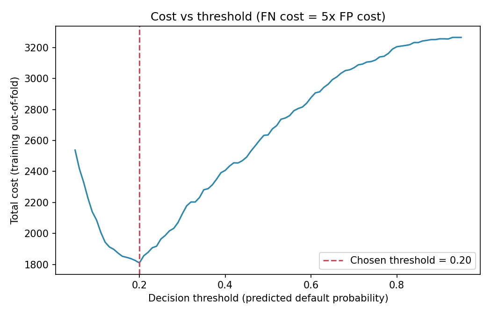

# Loan Default Risk Analysis

A small, reproducible data science project that predicts whether a loan applicant will **default**, and chooses an approval threshold based on **business cost** rather than a default 50% cut-off. It follows the **CRISP-DM** methodology and was built for a Data Methodology unit.

> **Note:** The dataset is **synthetic** (generated by `src/generate_data.py` with a fixed seed). Real lending data is confidential, and generating data from stated rules makes the project fully reproducible and shareable. Results describe the synthetic data, not real borrowers.

---

## 1. Business / problem understanding

| Item | Description |
|---|---|
| **Domain** | Finance (consumer credit risk) |
| **Question** | Which loan applicants are likely to default, and where should the lender set its approval cut-off? |
| **Stakeholder** | A credit-risk manager at a lender |
| **Key insight** | The two error types are not equally costly. Approving a borrower who defaults (false negative) loses principal; rejecting a good borrower (false positive) only loses interest. |
| **Assumption** | A false negative costs **5x** a false positive (`src/config.py`, easy to change) |
| **Success metrics** | ROC-AUC and PR-AUC for ranking quality; total business cost for the final decision rule |

## 2. Data

- **Source:** synthetic, generated by `src/generate_data.py` (seed 42).
- **Size:** 5,000 applicants (plus 25 injected duplicate rows), 12 features and 1 target (`default`, about 16% positive).
- **Deliberate quality problems** injected to demonstrate the cleaning step: about 3% missing income, 4% missing employment years, 25 duplicate rows.
- See [`docs/data_dictionary.md`](docs/data_dictionary.md) for every column.
- **Using real data instead:** save any real dataset as `data/raw/loan_applications_raw.csv` with the same column names and skip the generator.

## 3. Methodology

The full mapping to CRISP-DM is in [`docs/methodology.md`](docs/methodology.md). In short:

1. **Generate / collect** the data.
2. **Check quality:** missing values, duplicates, business-rule validation (age, credit-score range, etc.), class balance.
3. **Explore** default rates by credit score, loan purpose and home ownership.
4. **Engineer a feature:** `loan_to_income = loan_amount / annual_income`.
5. **Model** Logistic Regression and Random Forest in scikit-learn pipelines (median imputation, scaling, one-hot encoding).
6. **Evaluate** with stratified 5-fold cross-validation, choose a cost-minimising threshold from out-of-fold predictions, then test once on a held-out 20%.

## 4. Project structure

```
loan-default-risk-analysis/
├── main.py                  # runs the whole pipeline
├── requirements.txt
├── src/
│   ├── config.py            # paths, seed, cost assumptions
│   ├── generate_data.py     # step 1: synthetic data
│   ├── data_quality.py      # step 2: checks and cleaning
│   ├── eda.py               # step 3: exploratory analysis and figures
│   └── train_model.py       # step 4-5: modelling, threshold, evaluation
├── tests/test_pipeline.py   # basic sanity tests
├── data/
│   ├── raw/                 # generated data (with quality issues)
│   └── processed/           # cleaned data
├── reports/                 # generated tables, metrics and figures
└── docs/                    # methodology and data dictionary
```

## 5. How to run

```bash
# 1. Clone the repository
git clone https://github.com/YOUR-USERNAME/loan-default-risk-analysis.git
cd loan-default-risk-analysis

# 2. (Recommended) create a virtual environment
python -m venv .venv
source .venv/bin/activate          # Windows: .venv\Scripts\activate

# 3. Install dependencies
pip install -r requirements.txt

# 4. Run the full pipeline
python main.py

# 5. (Optional) run the tests
pytest
```

All outputs are written to `reports/`.

## 6. Results

Cross-validation on the training set (5 folds, default 0.5 threshold for precision/recall):

| Model | ROC-AUC | PR-AUC | Precision | Recall |
|---|---|---|---|---|
| **Logistic Regression** | 0.789 | 0.474 | 0.665 | 0.214 |
| Random Forest | 0.772 | 0.444 | 0.713 | 0.070 |

Logistic Regression ranked borrowers best (ROC-AUC) and was chosen. On the unseen test set (1,000 applicants, 163 defaulters), the decision threshold makes the real difference:

| Decision rule | Threshold | Precision | Recall | Total cost |
|---|---|---|---|---|
| Approve everyone (baseline) | n/a | n/a | 0% | 815 |
| Default cut-off | 0.50 | 0.558 | 0.147 | 714 |
| **Cost-based cut-off** | **0.20** | 0.352 | 0.663 | **474** |

Test ROC-AUC = 0.789 and PR-AUC = 0.432 (the no-skill PR-AUC is the 16.3% default rate). Moving from the default 0.5 cut-off to the cost-based 0.20 cut-off cut total cost by about 34%, because it catches far more defaulters at the price of rejecting more good applicants.



## 7. Key findings

- **Credit score is the strongest single signal:** default rates fall from about 40% for scores below 580 to about 3% for scores of 800 and above.
- **Previous defaults matter:** 14% default with no history, 27% with one prior default, 35% with two.
- **Renters default more** (19%) than owners (13%) or mortgage holders (15%), and higher debt-to-income ratios are associated with more defaults.
- **A simple model won:** Logistic Regression beat Random Forest, so extra complexity was not justified.
- **Accuracy would be misleading:** predicting "no default" for everyone would be about 84% accurate yet useless. ROC-AUC, PR-AUC and cost are the right yardsticks.

## 8. Limitations and ethical considerations

- **Synthetic data:** patterns are put there by the generator, so real-world performance would differ.
- **Cost ratio is an assumption:** a real lender would estimate it from actual loss and interest figures. Change `COST_FALSE_NEGATIVE` in `src/config.py` and re-run to see how the threshold moves.
- **Fairness:** credit models can disadvantage groups if inputs act as proxies for protected traits (for example age or location). This project uses no protected attributes beyond age and does not include a formal fairness audit.
- **Explainability:** lenders often must explain rejections. Logistic Regression coefficients are easier to explain than a forest.
- **Next steps:** probability calibration, hyper-parameter tuning, fairness metrics across age groups, and validation on real data.

## 9. Reproducibility

A fixed random seed (`RANDOM_STATE = 42` in `src/config.py`) is used for data generation, splitting, cross-validation and the Random Forest, so re-running the pipeline gives the same numbers.

## 10. References

- Wirth, R., & Hipp, J. (2000). CRISP-DM: Towards a standard process model for data mining.
- Pedregosa et al. (2011). Scikit-learn: Machine Learning in Python. *JMLR, 12*, 2825-2830.
- Elkan, C. (2001). The foundations of cost-sensitive learning. *IJCAI*.

## 11. Author

VICTOR APAMO. Licensed under the MIT License.
